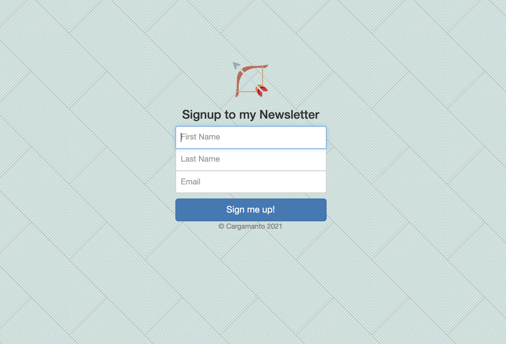

# Clean Email Newsletter

## Description

I created a simple signup page that collects emails using the MailChimp marketing API. I deployed the page using Heroku.

## What I learned 🤓

- Using Express to render a website with live API data
- Parse POST request to server
- MailChimp API
- deploying server to Heroku
